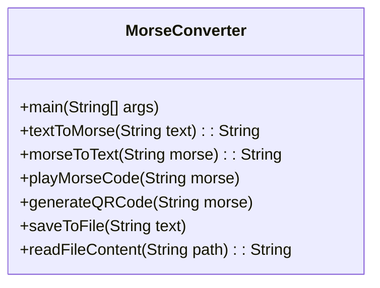

# MorseWise: The Code Converter & QR Wizard

## 📌 Overview
MorseWise is a versatile Java application that bridges traditional Morse code with modern technology. It offers seamless text-to-Morse and Morse-to-text conversion, QR code generation for Morse messages, and advanced playback features—all wrapped in an intuitive interface.

## ✨ Key Features
- **Bi-directional Conversion**: 
  - 🔤 Text ↔ Morse code translation
  - Supports uppercase/lowercase letters, numbers, and special characters
- **Audio Playback**: 
  - 🔊 Standard Morse code sounds
  - 🎛️ Customizable speed, pitch, and volume
- **File Integration**: 
  - 📂 Upload text files for batch conversion
  - 💾 Save converted text to files
- **QR Code Generation**: 
  - 📲 Create scannable QR codes from Morse messages
- **History Tracking**: 
  - 🕰️ View and save all conversion sessions

## 🛠️ Technical Implementation


## 🚀 Getting Started
### Prerequisites
- Java JDK 11+
- Maven (for dependency management)
- ZXing library (QR code generation)

### Installation
1. Clone the repository:
   ```bash
   git clone https://github.com/yourusername/morsewise.git
   ```
2. Build the project:
   ```bash
   mvn clean install
   ```
3. Run the application:
   ```bash
   java -jar target/morsewise-1.0.jar
   ```

## 🎮 Usage Examples
1. **Text to Morse Conversion**:
   ```
   Choose option: 1
   Enter text: Hello World
   Morse Code: .... . .-.. .-.. --- / .-- --- .-. .-.. -..
   ```

2. **Generate QR Code**:
   ```
   Choose option: 5
   Enter Morse code: ... --- ...
   QR code saved as: qrcode.png
   ```

## 📊 Results
| Feature | Input | Output |
|---------|-------|--------|
| Text→Morse | "SOS" | "... --- ..." |
| Morse→Text | "... --- ..." | "SOS" |
| QR Code | "... --- ..." |  |

## 🌟 Advantages
- Preserves Morse code heritage while modernizing its utility
- Enhances learning through interactive audio feedback
- Facilitates emergency communication with QR code integration
- Simplifies bulk conversions with file processing

## 👥 Team
- **Shreya Arun**-shreyaarun005@gmail.com
- **Siri Sanjana S** -sirisanjana.singareddy@gmail.com
- **Anagha Menon** (CB.SC.U4AIE23212)
- **Varshitha Thilak Kumar**-varshitha.9a2019@gmail.com


---

<div align="center">
  <i>"Connecting dots and dashes to the digital future"</i>
</div>
```
